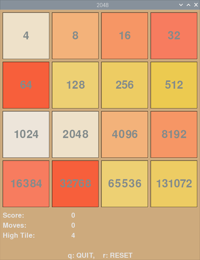

# 2048
This is a python3 / pygame implementation of the 2048 game.

The goal of the game is to combine tiles to get a tile with a value of 2048 (or greater, the maximum theoretical value is 131072). The arrow keys move all the tiles left, right, up or down as far as they can go. If a tile is moved into a tile with the same value, the two tiles are merged and the merged tile gets the value twice the original values. After every move, a new tile with a random value of 2 or 4 is added to a random empty location. The game is over when the grid is full and no merges are available.

q or the window close X quits

r restarts the game